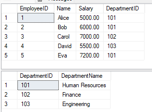
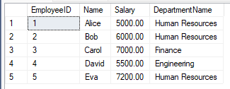
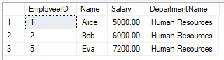
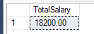
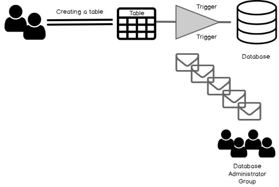
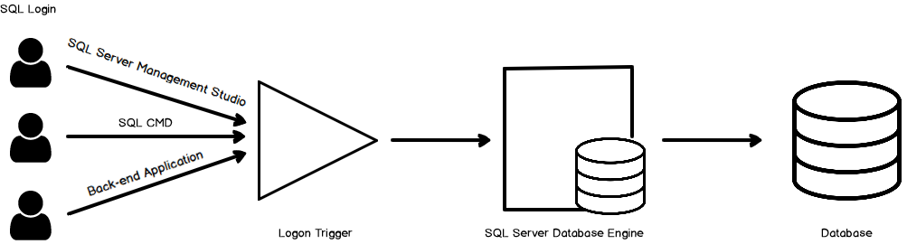

# **Mastering Stored Procedures & Triggers**

## **Stored Procedure** 

### What is a Stored Procedure?
A stored procedure is a precompiled collection of one or more SQL statements stored 
in the database. It can be executed multiple times with different parameters, 
allowing for efficient reuse of logic, reduced duplication, and better performance.
Stored procedures support input parameters, allow encapsulation of logic, and can perform a wide range of operations like data manipulation, validation, transactions, and reporting.


### Benefits of Stored Procedures?

**1. Performance Optimization:**

- Stored procedures are compiled once and stored as executable plans.
- On subsequent calls, the database reuses the compiled plan, speeding up execution.

**2. Reduced Network Traffic:**

- Since stored procedures encapsulate multiple SQL statements, only the procedure call is sent over the network, not each individual SQL statement.

**3. Improved Security:**

- Users can be granted permission to execute a stored procedure without having direct access to underlying tables.
- Using EXECUTE AS can impersonate specific users and protect sensitive data.

**4. Code Reusability & Maintainability:**

- Avoids repeating code for repetitive tasks.
- If changes are needed, only the stored procedure needs to be updated—not every application or client that uses it.

**5. Error Handling:**

- SQL Server supports error handling with TRY...CATCH blocks inside procedures.

**6. Modularity & Abstraction:**

- Procedures let you abstract complex SQL logic away from client applications.
- Parameters can be used for dynamic input.

### Drawbacks of Stored Procedures?
**1. Debugging Difficulty:** Debugging can be more complex compared to regular SQL.

**2. Versioning:** Harder to manage versions compared to application code.

**3. Portability:** Procedures are often tied to a specific DBMS (e.g., SQL Server vs Oracle).

**4. Testing Complexity:** Errors may only surface at runtime.

**5. Resource Overhead:** Complex or overused procedures can consume server resources.

**6. Developer Costs:** Writing efficient procedures may require skilled DBAs or SQL developers.

### Types of stored procedures?
**1. User-defined:**

A user-defined procedure can be created in a user-defined database or in all system 
databases except the Resource database. The procedure can be developed in either 
Transact-SQL, or as a reference to a Microsoft .NET Framework common runtime 
language (CLR) method.

**2. Temporary:**

Temporary procedures are a form of user-defined procedures. Temporary procedures are 
like a permanent procedure, except that they're stored in tempdb. There are two types 
of temporary procedures: local and global. They differ from each other in their names, 
their visibility, and their availability. Local temporary procedures have a single 
number sign (#) as the first character of their names; they're visible only to the 
current user connection, and they're deleted when the connection is closed. 
Global temporary procedures have two number signs (##) as the first two 
characters of their names; they're visible to any user after they are created, 
and they're deleted at the end of the last session using the procedure.

**3. System:**

System procedures are included with the Database Engine. They are physically 
stored in the internal, hidden Resource database and logically appear in the 
sys schema of every system-defined and user-defined database. In addition, 
the msdb database also contains system stored procedures in the dbo schema 
that are used for scheduling alerts and jobs. Because system procedures 
start with the prefix sp_, we recommend that you don't use this prefix 
when naming user-defined procedures. For a complete list of system procedures, 
see System stored procedures (Transact-SQL).SQL Server supports the system 
procedures that provide an interface from SQL Server to external programs 
for various maintenance activities. These extended procedures use the xp_ prefix. 
For a complete list of extended procedures, see General 
extended stored procedures (Transact-SQL).

**4. Extended user-defined:**

Extended procedures enable creating external routines in a programming language such as C. 
These procedures are DLLs that an instance of SQL Server can dynamically load and run.

**~~NOTE:~~ Extended stored procedures will be removed in a future version of SQL Server. 
Don't use this feature in new development work.**

**5. Stored Procedures in CLR:**

These are SQL Server-based stored procedures that are written in.NET languages, 
such as C#. When complex functionality is required that is difficult to implement with 
T-SQL alone, such as interacting with external APIs or complex string manipulation, 
CLR stored procedures can be helpful

### Stored Procedure Syntax

1. Simple Stored Procedure Syntax:

```sql
--1. Create a Simple Stored Procedure:
CREATE PROCEDURE procedure_name
AS
BEGIN
   --sql_statement
END;

--2.  Execute a Simple Stored Procedure:
EXEC procedure_name;

--3. Example:

CREATE PROCEDURE SelectAllCustomers
AS
BEGIN
SELECT * FROM Customers
END;

EXEC SelectAllCustomers;

```

2. Stored Procedure With One Parameter:

```sql
--1. Create Stored Procedure With One Parameter:

CREATE PROCEDURE procedure_name @Parameter_name datatype
AS
BEGIN
--sql_statement with  @Parameter_name
END;

--2. Execute Stored Procedure With One Parameter:
EXEC procedure_name @Parameter_name;

--3. Example
CREATE PROCEDURE SelectAllCustomers @City nvarchar(30)
AS
BEGIN
SELECT * FROM Customers WHERE City = @City
END;
EXEC SelectAllCustomers @City = 'London';

```

3. Stored Procedure With Multiple Parameters:
```sql
--1. Create Stored Procedure With Multiple Parameters:
CREATE PROCEDURE procedure_name @Parameter_name1 datatype , @Parameter_name2 datatype
AS
BEGIN
--sql_statement with  @Parameter_name1 ,@Parameter_name2
END;

--2. Execute Stored Procedure With Multiple Parameters:
EXEC procedure_name @Parameter_name1, @Parameter_name2;

--3. Example
CREATE PROCEDURE SelectAllCustomers @City nvarchar(30), @PostalCode nvarchar(10)
AS
BEGIN
SELECT * FROM Customers WHERE City = @City AND PostalCode = @PostalCode
END;
EXEC SelectAllCustomers @City = 'London', @PostalCode = 'WA1 1DP';

```
### Apply Stored Procedure in Practice 

1. Create a real-life case database (Company):
```sql
-- Cerate and use the database
create database TeamworkDB
use TeamworkDB
```

2. Create a table (Employees, Departments):
```sql
-- Create Departments table
CREATE TABLE Departments (
    DepartmentID INT PRIMARY KEY,
    DepartmentName VARCHAR(100) NOT NULL
);
-- Create Employees table with foreign key to Departments
CREATE TABLE Employees (
    EmployeeID INT IDENTITY PRIMARY KEY,
    Name VARCHAR(100) NOT NULL,
    Salary DECIMAL(10, 2) NOT NULL,
    DepartmentID INT NOT NULL,
    FOREIGN KEY (DepartmentID) REFERENCES Departments(DepartmentID)
);
```

3. Insert data into the tables:
```sql
-- Insert sample data into Departments
INSERT INTO Departments (DepartmentID, DepartmentName) VALUES
(101, 'Human Resources'),
(102, 'Finance'),
(103, 'Engineering');
-- Insert sample data into Employees
INSERT INTO Employees (Name, Salary, DepartmentID) VALUES
('Alice', 5000.00, 101),
('Bob', 6000.00, 101),
('Carol', 7000.00, 102),
('David', 5500.00, 103),
('Eva', 7200.00, 101);
```


4. Create a simple stored procedure to retrieve all employees by department:
```sql
--  Procedure WITHOUT Parameters
CREATE PROCEDURE GetAllEmployees
AS
BEGIN
    SELECT e.EmployeeID, e.Name, e.Salary, d.DepartmentName
    FROM Employees e
    INNER JOIN Departments d ON e.DepartmentID = d.DepartmentID;
END;
-- How to Execute It
EXEC GetAllEmployees;
```


5. Create a stored procedure with parameter to retrieve all employees by specific department id:
```sql
--  Procedure with One Parameter
CREATE PROCEDURE GetEmployeesByDepartment
    @DepartmentID INT
AS
BEGIN
    SELECT e.EmployeeID, e.Name, e.Salary, d.DepartmentName
    FROM Employees e
    INNER JOIN Departments d ON e.DepartmentID = d.DepartmentID
    WHERE e.DepartmentID = @DepartmentID;
END;
-- How to Execute It
EXEC GetEmployeesByDepartment @DepartmentID = 101;
```


6. Create a stored procedure with multiple parameters to calculate total salary by department:
```sql
--  Procedure with Two Parameter
-- Create stored procedure to calculate total salary by department ( Multi Parameters )
CREATE PROCEDURE CalculateTotalSalaryByDepartment
    @DepartmentID INT,               -- Input parameter
    @TotalSalary DECIMAL(10, 2) OUTPUT  -- Output parameter
AS
BEGIN
    SELECT @TotalSalary = SUM(Salary)
    FROM Employees
    WHERE DepartmentID = @DepartmentID;
END;
-- How to Execute It
-- Declare a variable to hold the output
DECLARE @Result DECIMAL(10, 2);
-- Call the procedure
EXEC CalculateTotalSalaryByDepartment
    @DepartmentID = 101,
    @TotalSalary = @Result OUTPUT;
-- Display the result
SELECT @Result AS TotalSalary;
```


## **Triggers** 

### What is SQL Triggers?
A trigger is a stored procedure in a database that automatically invokes whenever 
a special event in the database occurs. By using SQL triggers, developers can automate 
tasks, ensure data consistency, and keep accurate records of database activities. 
For example, a trigger can be invoked when a row is inserted into a specified table or 
when specific table columns are updated.

### Types of SQL triggers?

**1. DDL Triggers (Data Definition Language):** 

- What is DDL Trigger?

The Data Definition Language (DDL) command events such as Create_table, 
Create_view, drop_table, Drop_view, and Alter_table cause the DDL triggers 
to be activated. They allow us to track changes in the structure of the database. 
The trigger will prevent any table creation, alteration, or deletion in the database.

- How DDL Trigger Works?

Every DDL operation generates one Transaction in case of the DDL Trigger have been 
applied at the Database or the Server level. The SQL Server generates the events with 
relevant information in the same transaction following the operation. Prepare a metric 
with extracting the DDL event function(EVENTDATA()) to wraps a policy or standards for 
deployment.



The EVENTDATA() is an inbuilt function of the DDL trigger in SQL Server and 
that would return exchange occasion subtleties with the number of the fields in XML format

- EventType (Create View, Alter View, Drop View, etc…).
- PostTime (Event trigger time).
- SPID (SQL Server session ID).
- ServerName (SQL Server instance name).
- LoginName (SQL Server Login name).
- UserName (username for login, by default dbo schema as username).
- DatabaseName (name of database where trigger was executed).
- SchemaName (schema name of the View).
- ObjectName (Name of the View).
- ObjectType (Object types. such as Table, view, procedure, etc…).
- TSQLCommand (Schema deployment Query which is executed by user).
- SetOptions (SET Option which are applied while Creating View or Modify it).
- CommandText (Create, Alter or Drop object command).

__Example: Prevent Table Deletions__
```sql 
CREATE TRIGGER prevent_table_creation
ON DATABASE
FOR CREATE_TABLE, ALTER_TABLE, DROP_TABLE
AS 
BEGIN
   PRINT 'you can not create, drop and alter table in this database';
   ROLLBACK;
END;
```

**2. DML Triggers (Data Manipulation Language):**

- What is DML Trigger?

DML triggers fire when we manipulate data with commands like INSERT, 
UPDATE, or DELETE. These triggers are perfect for scenarios where we 
need to validate data before it is inserted, log changes to a table, 
or cascade updates across related tables.

__Example: Prevent Unauthorized Updates__
```sql
CREATE TRIGGER prevent_update 
ON students
FOR UPDATE 
AS 
BEGIN 
   PRINT 'You can not insert, update and delete this table i'; 
   ROLLBACK; 
END;
```
**3. Logon Triggers:**

- What is Logon Trigger?

Logon triggers are useful for monitoring user sessions or restricting 
user access to the database. As a result, the PRINT statement messages 
and any errors generated by the trigger will all be visible in the SQL 
Server error log.

- How Logon Trigger Works?

Triggers is a database code that gets executed in case of a precisely 
defined event. We can use logon triggers to control the SQL login 
security. SQL Server automatically executes the logon triggers once 
a logon event occurs. It gets executed before a user session is 
established and authentication is successful.

__We use two terms for a database successful connection in any database:__

**1. Authentication:** We specify a username and password to connect using SQL authentication. It is a validation of the user’s credentials
**2. Authorization:** It is a permission that allows you to do specific tasks. You may be authorized to have full access to a specific database but not authorized to make any changes at the instance level
Logon Trigger integration



If any user is unable to authenticate to SQL Server (wrong credentials), 
SQL Server does not execute the logon triggers. SQL Server starts an 
implicit transaction before the logon triggers fires. It is independent 
of any user transaction. In the case of the logon trigger, the 
transaction count is 1. In case SQL returns an exception, its 
value sets to zero. It fails the implicit transaction, and the 
user session is not established. User connection also fails in 
case of the error having severity more significant than 20 inside 
the trigger.

__Example: Track User Logins__
```sql
CREATE TRIGGER track_logon
ON LOGON
AS
BEGIN
   PRINT 'A new user has logged in.';
END;
```


