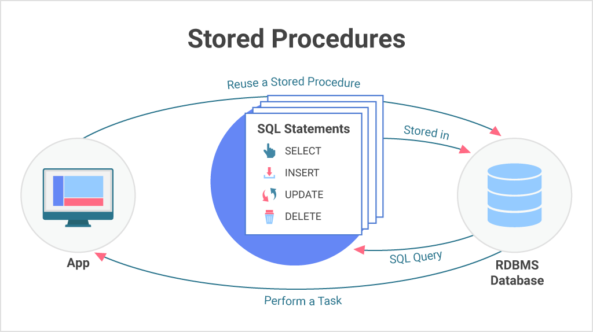

# **Stored Procedure** 

## What is a Stored Procedure?
A stored procedure is a group of prepared SQL code that you can save, 
so the code can be reused over and over again by simply calling it whenever needed.

It can be used to perform a wide range of database operations 
such as inserting, updating, or deleting data, generating reports, 
and performing complex calculations. Stored procedures are very useful 
because they allow you to encapsulate (bundle) a set of SQL statements as 
a single unit and execute them repeatedly with different parameters, 
making it easy to manage and reuse the code.

## Advantage of using stored procedures?
**1. Reduced server/client network traffic:** 

The commands in a procedure are executed as a single batch of code. 
This can significantly reduce network traffic between the server 
and client because only the call to execute the procedure is sent 
across the network. Without the code encapsulation provided by a procedure, 
every individual line of code would have to cross the network.

**2. Stronger security:**

Multiple users and client programs can perform operations on underlying database 
objects through a procedure, even if the users and programs don't have direct 
permissions on those underlying objects. The procedure controls what processes and 
activities are performed and protects the underlying database objects. 
This eliminates the requirement to grant permissions at the individual 
object level and simplifies the security layers.The EXECUTE AS clause can 
be specified in the CREATE PROCEDURE statement to enable impersonating 
another user, or enable users or applications to perform certain database 
activities without needing direct permissions on the underlying objects and 
commands.When an application calls a procedure over the network, only the call 
to execute the procedure is visible. Therefore, malicious users can't see table 
and database object names, embed Transact-SQL statements of their own, or search 
for critical data.

**3. Reuse of code:**

The code for any repetitious database operation is the perfect candidate for 
encapsulation in procedures. This eliminates needless rewrites of the same code, 
decreases code inconsistency, and allows the access and execution of code by any 
user or application possessing the necessary permissions.

**4. Easier maintenance:**

When client applications call procedures and keep database operations in the 
data tier, only the procedures must be updated for any changes in the underlying 
database. The application tier remains separate and doesn't have to know how 
about any changes to database layouts, relationships, or processes.

**5. Improved performance:**

By default, a procedure compiles the first time it's executed, and creates an 
execution plan that is reused for subsequent executions. Since the query 
processor doesn't have to create a new plan, it typically takes less time to 
process the procedure.If there are significant changes to the tables or data 
referenced by the procedure, the precompiled plan might actually cause the 
procedure to perform slower. In this case, recompiling the procedure and forcing 
a new execution plan can improve performance.